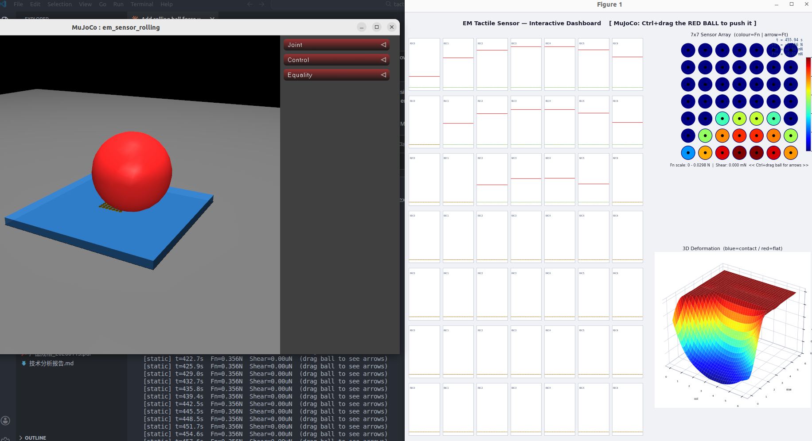

# em_tactile_sim

> 基于 MuJoCo 的电磁（霍尔效应）触觉传感器仿真库。

[](https://www.python.org/downloads/)
[](https://mujoco.org/)
[](https://opensource.org/licenses/MIT)
[](tests/)

`em_tactile_sim` 在 MuJoCo 中对深圳元触科技有限公司生产的电磁触觉传感器进行建模。它在每个物理仿真步骤中提取接触力，使用赫兹接触力学将力分布到各感测单元，并通过线性霍尔响应模型生成逼真的传感器输出向量。

---

## 功能特性

- **两种传感器型号** — 标准版 7×7 和 Custom1 版 6×6，通过 `SensorConfig` 灵活配置
- **物理精确的力分布** — 赫兹接触模型将法向力和剪切力分配到各感测单元
- **逼真的霍尔响应** — 线性灵敏度模型将力阵列映射为原始传感器输出向量
- **MuJoCo 回调集成** — 使用 `mjcb_sensor` 回调，具有完整的注册/注销生命周期管理
- **完整输出向量** — `[fn_array, resultant, temperature]` 与实体硬件协议一致
- **充分测试** — 38 个单元测试和集成测试，覆盖完整仿真流水线

---

## 安装

**前置条件：** Python 3.10+，MuJoCo 3.0+

```bash
git clone git@github.com:hzm8341/em_tactile_sim.git
cd em_tactile_sim
pip install -e .
```

安装开发依赖（pytest）：

```bash
pip install -e ".[dev]"
```

---

## 快速开始

```python
from em_tactile_sim.core.sensor_config import SensorConfig, SensorVariant
from em_tactile_sim.mujoco.env import EMTactileEnv

# 标准版 7×7 传感器
cfg = SensorConfig()

# Custom1 版 6×6 传感器
cfg = SensorConfig(SensorVariant.CUSTOM1)

# 加载 MuJoCo 模型并创建环境
env = EMTactileEnv("em_tactile_sim/mujoco/models/em_sensor_flat.xml", cfg)

# 推进仿真
env.step()

# 读取传感器输出
tactile   = env.get_tactile()       # (7, 7, 3)  — 每个单元的 [fn, ftx, fty]
resultant = env.get_resultant()     # (3,)        — 合力向量
flat      = env.get_tactile_flat()  # (151,)      — 完整输出向量
temp      = env.get_temperature()   # float       — 温度（Phase 1：固定为 0.0）

# 清理资源
env.reset()
env.close()
```

---

## 传感器规格

| 参数         | 标准版 (Standard) | Custom1 版     |
|--------------|-------------------|----------------|
| 感测阵列     | 7×7               | 6×6            |
| 尺寸         | 43×28×8 mm        | 20×17×9 mm     |
| 通信接口     | USB Type-C        | CAN 总线        |
| 采样率       | 120 Hz            | 120 Hz         |
| 法向力范围   | 0–20 N            | 0–20 N         |
| 剪切力范围   | ±10 N             | ±10 N          |
| 分辨率       | 0.05 N            | 0.05 N         |
| 输出维度     | 151               | 112            |

**标准版输出向量布局：** `[fn_array (147), resultant (3), temperature (1)]` = 151 维

---

## 系统架构

```
MuJoCo 物理仿真步骤
        │
        ▼
EMSensorCallback (mjcb_sensor)
        │  各 site 的原始接触力
        ▼
ContactModel（赫兹接触力学）
        │  每单元力分布  (rows × cols × 3)
        ▼
compute_output()（线性霍尔响应）
        │  传感器输出向量
        ▼
 [fn_array | resultant | temperature]
  147 维       3 维        1 维
            = 151 维（标准版）
```

### 模块结构

```
em_tactile_sim/
  core/
    sensor_config.py     SensorVariant 枚举 + SensorConfig 数据类
    contact_model.py     ContactModel：赫兹接触力学
    hall_response.py     compute_output()：力阵列 → 传感器向量
  mujoco/
    models/
      em_sensor_flat.xml              MJCF 模型（7×7 传感垫 + 下落球体）
      em_sensor_flat_with_sites.xml   带可视化 site 标记的版本
      gen_sites.py                    生成 site XML 元素的脚本
    callback.py          EMSensorCallback：注册 mjcb_sensor
    env.py               EMTactileEnv：step/get_tactile/reset/close/render
  isaac/                 （占位符 — Phase 2）
```

---

## 运行测试

```bash
pytest tests/ -v
```

预期结果：**38 个测试全部通过**

| 测试文件                     | 测试数 | 覆盖内容                              |
|------------------------------|--------|---------------------------------------|
| `test_sensor_config.py`      | 10     | SensorVariant 枚举、SensorConfig 字段 |
| `test_contact_model.py`      | 11     | 赫兹力学、力分布计算                  |
| `test_hall_response.py`      | 8      | 霍尔响应、输出向量结构                |
| `test_integration.py`        | 9      | 完整 MuJoCo 仿真流水线               |

---

## 示例程序

### 球体下落演示（无显示界面）

将球体落到传感垫上，每 0.1 秒打印一次最大法向力。

```bash
python examples/flat_press_test.py
```

### 实时热力图（需要显示界面）

使用 matplotlib 渲染 7×7 实时力热力图。

```bash
python examples/visualize_array.py
```

### 交互式仪表盘

触觉传感器数据可视化交互式仪表盘，支持时序图和实时更新。



```bash
python3 examples/interactive_dashboard.py
```

---

## API 参考

### `SensorConfig`

```python
from em_tactile_sim.core.sensor_config import SensorConfig, SensorVariant

cfg = SensorConfig()                       # 标准版 7×7，输出 151 维
cfg = SensorConfig(SensorVariant.CUSTOM1)  # Custom1 版 6×6，输出 112 维
```

主要字段：`rows`、`cols`、`output_dim`、`hall_sensitivity`、`variant`。

### `EMTactileEnv`

```python
env = EMTactileEnv(model_path: str, config: SensorConfig)
```

| 方法                         | 返回值          | 说明                                     |
|------------------------------|-----------------|------------------------------------------|
| `env.step()`                 | `None`          | 推进一个物理仿真步骤                     |
| `env.get_tactile()`          | `(R, C, 3)`     | 每单元 `[fn, ftx, fty]` 阵列             |
| `env.get_resultant()`        | `(3,)`          | 合力向量                                 |
| `env.get_tactile_flat()`     | `(output_dim,)` | 完整输出向量                             |
| `env.get_temperature()`      | `float`         | 温度值（Phase 1 固定返回 `0.0`）         |
| `env.reset()`                | `None`          | 重置仿真状态                             |
| `env.close()`                | `None`          | 注销 `mjcb_sensor` 回调                  |

**重要说明：** 使用完毕后务必调用 `env.close()`。`EMSensorCallback` 会注册一个全局 `mjcb_sensor` 回调；若未注销，将影响同一进程中后续创建的 MuJoCo 环境。

---

## 开发路线图

| 阶段   | 状态     | 描述                                                        |
|--------|----------|-------------------------------------------------------------|
| 第一阶段 | 已完成  | MuJoCo 集成、赫兹接触模型、线性霍尔响应、38 个测试         |
| 第二阶段 | 计划中  | Isaac Sim 集成（`em_tactile_sim/isaac/`）                   |
| 第三阶段 | 计划中  | 真实传感器数据采集与标定                                    |
| 第四阶段 | 计划中  | LUT / MLP 霍尔效应响应模型                                  |

---

## 许可证

MIT © 2024

---

## 致谢

传感器规格及硬件参考由**深圳元触科技有限公司**提供。
